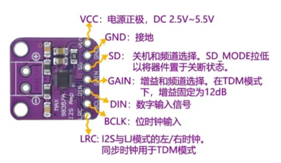
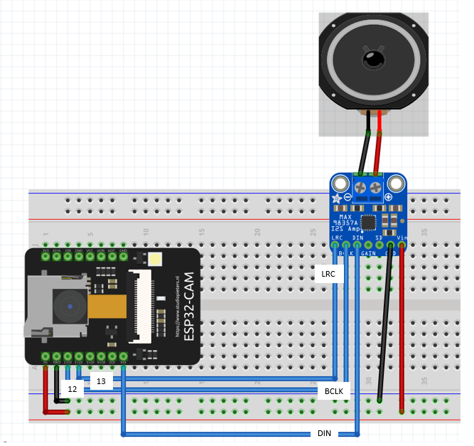

<h1>【練習題目 : ESP32_CAM + MAX98375音訊放大器 + 喇叭】</h1>

## 準備材料 : 
>1. ESP32-CAM 板 X 1
>2. SD 卡 X 1
>3. MAX98375 音訊放大器 X 1
>4. 喇叭 X 1
>5. 杜邦線數條
>6. 麵包板 X 1<br>
=========

## ESP32_Cam 腳位圖
>

## MAX98375 音訊放大器
>

## 完整電路圖
>

## 相關函式 : 安裝開發板管理員 ESP32 

## 語音檔案 : 
請在 SD卡建立一個資料夾為 Data ， 並且存入 hello.wav、thanks.wav、yes.wav、finish.wav 的音訊檔案

## 程式說明
[以下程式來源 ESP32CAM_MAX.ino ]:[https://github.com/derricktsai0904/Arduino/edit/master/06.ESP32%E6%8E%A7%E5%88%B6/ESP32CAM_MAX98375_%E9%9F%B3%E8%A8%8A/ESP32CAM_MAX98375.ino](https://github.com/derricktsai0904/Arduino/edit/master/06.ESP32%E6%8E%A7%E5%88%B6/ESP32CAM_MAX98375_%E9%9F%B3%E8%A8%8A/ESP32CAM_MAX98375.ino) "ESP32CAM_MAX98375.ino"
[以下程式來源 ESP32CAM_MAX98375.ino ]
``` arduino

#include <Arduino.h>
#include "esp_camera.h"
#include <WiFi.h>
#include <WebServer.h>

#include "FS.h"
#include "SD_MMC.h"

#include "driver/i2s.h"
#include <math.h>


// ======================================================
// WiFi
// ======================================================

const char* ssid     = "XXXXXXXX";   // 網路熱點名稱(請修改) 
const char* password = "XXXXXXXX";   // 網路熱點密碼(請修改)


// ======================================================
// AI Thinker ESP32-CAM Camera Pins
// ======================================================

#define PWDN_GPIO_NUM     32
#define RESET_GPIO_NUM    -1

#define XCLK_GPIO_NUM      0
#define SIOD_GPIO_NUM     26
#define SIOC_GPIO_NUM     27

#define Y9_GPIO_NUM       35
#define Y8_GPIO_NUM       34
#define Y7_GPIO_NUM       39
#define Y6_GPIO_NUM       36
#define Y5_GPIO_NUM       21
#define Y4_GPIO_NUM       19
#define Y3_GPIO_NUM       18
#define Y2_GPIO_NUM        5

#define VSYNC_GPIO_NUM    25
#define HREF_GPIO_NUM     23
#define PCLK_GPIO_NUM     22


// ======================================================
// MAX98357A
// ======================================================
//
// SD_MMC 1-bit mode:
// GPIO14 = CLK
// GPIO15 = CMD
// GPIO2  = DATA0
//
// MAX98357A:
//
// GPIO12 → BCLK
// GPIO13 → LRC
// GPIO4  → DIN
//
// ★ 重要：使用 I2S_NUM_1
//
// ======================================================

#define I2S_BCLK   12
#define I2S_LRC    13
#define I2S_DOUT    4

#define I2S_PORT I2S_NUM_1


// ======================================================
// Web Server
// ======================================================
//
// Port 80 = 控制網頁
// Port 81 = Camera Stream
//
// ======================================================

WebServer webServer(80);

WiFiServer streamServer(81);


// ======================================================
// 系統狀態
// ======================================================

bool cameraReady = false;
bool sdReady     = false;
bool audioReady  = false;


// ======================================================
// 防止同時播放兩個音訊
// ======================================================

volatile bool audioPlaying = false;


// ======================================================
// HTML
// ======================================================

const char INDEX_HTML[] PROGMEM = R"rawliteral(

<!DOCTYPE html>

<html lang="zh-TW">

<head>

<meta charset="UTF-8">

<meta name="viewport"
content="width=device-width, initial-scale=1.0">

<title>
ESP32-CAM 智慧語音系統
</title>


<style>

*{
    box-sizing:border-box;
}

body{

    margin:0;

    background:#101820;

    color:white;

    font-family:
        Arial,
        "Microsoft JhengHei",
        sans-serif;

    text-align:center;
}


/* ============================ */
/* Header */
/* ============================ */

header{

    background:#173650;

    padding:14px;

    box-shadow:
        0 3px 12px rgba(0,0,0,0.5);

}


h1{

    margin:4px;

    font-size:27px;

}


.subtitle{

    color:#cccccc;

    font-size:14px;

}


/* ============================ */
/* Main */
/* ============================ */

.container{

    width:96%;

    max-width:900px;

    margin:auto;

    padding:15px;

}


/* ============================ */
/* Camera */
/* ============================ */

.camera-box{

    background:#000;

    padding:10px;

    border-radius:15px;

    box-shadow:
        0 5px 20px rgba(0,0,0,0.6);

}


#stream{

    width:100%;

    max-width:640px;

    min-height:240px;

    border-radius:10px;

}


/* ============================ */
/* Control */
/* ============================ */

.control{

    margin-top:18px;

    padding:20px;

    background:#1d364b;

    border-radius:15px;

}


.control h2{

    margin-top:0;

}


button{

    min-width:135px;

    height:50px;

    margin:7px;

    border:none;

    border-radius:10px;

    background:#2878c8;

    color:white;

    font-size:19px;

    font-weight:bold;

    cursor:pointer;

}


button:hover{

    background:#3998ef;

}


button:active{

    transform:scale(0.97);

}


/* ============================ */
/* Status */
/* ============================ */

.status{

    min-height:45px;

    margin-top:15px;

    padding:10px;

    font-size:19px;

    color:#7cff9e;

}


.system-info{

    margin-top:10px;

    padding:10px;

    font-size:15px;

    line-height:1.8;

    color:#dddddd;

}


footer{

    margin-top:10px;

    padding:20px;

    color:#888888;

    font-size:12px;

}

</style>


</head>


<body>


<header>

<h1>
ESP32-CAM 智慧語音系統
</h1>

<div class="subtitle">

Camera + SD Card + MAX98357A

</div>

</header>


<div class="container">


<!-- Camera -->

<div class="camera-box">


</div>


<!-- Control -->

<div class="control">


<h2>
SD 卡中文語音播放
</h2>


<button onclick="playVoice('hello')">
您好
</button>


<button onclick="playVoice('yes')">
可以
</button>


<button onclick="playVoice('thanks')">
謝謝
</button>


<button onclick="playVoice('finish')">
結束
</button>


<br>


<button onclick="playVoice('test')">
測試音
</button>


<button onclick="systemStatus()">
系統狀態
</button>


<div
id="status"
class="status">

等待操作

</div>


<div
id="system"
class="system-info">

系統初始化中...

</div>


</div>


</div>


<footer>

ESP32-CAM + SD_MMC + MAX98357A I2S

</footer>


<script>


// ======================================================
// 初始化 Camera Stream
// ======================================================

function initStream()
{

    const url =
        "http://" +
        window.location.hostname +
        ":81/stream";


    document.getElementById(
        "stream"
    ).src = url;


    document.getElementById(
        "system"
    ).innerHTML =
        "Video Stream : " + url;

}


// ======================================================
// 播放聲音
// ======================================================

function playVoice(name)
{

    document.getElementById(
        "status"
    ).innerHTML =
        "正在播放...";


    fetch(
        "/play?voice=" + name
    )

    .then(
        response =>
        response.text()
    )

    .then(
        text =>
        {

            document.getElementById(
                "status"
            ).innerHTML =
                text;

        }
    )

    .catch(
        error =>
        {

            document.getElementById(
                "status"
            ).innerHTML =
                "連線失敗";

        }
    );

}


// ======================================================
// 系統狀態
// ======================================================

function systemStatus()
{

    fetch("/status")

    .then(
        response =>
        response.text()
    )

    .then(
        data =>
        {

            document.getElementById(
                "system"
            ).innerHTML =
                data.replace(
                    /\n/g,
                    "<br>"
                );

        }
    );

}


// ======================================================
// Page Load
// ======================================================

window.onload =
function()
{

    initStream();

    setTimeout(
        systemStatus,
        1000
    );

};


</script>


</body>

</html>

)rawliteral";


// ======================================================
// Camera 初始化
// ======================================================

bool initCamera()
{

    Serial.println();
    Serial.println("[1] Initializing Camera...");


    camera_config_t config;


    config.ledc_channel =
        LEDC_CHANNEL_0;

    config.ledc_timer =
        LEDC_TIMER_0;


    config.pin_d0 =
        Y2_GPIO_NUM;

    config.pin_d1 =
        Y3_GPIO_NUM;

    config.pin_d2 =
        Y4_GPIO_NUM;

    config.pin_d3 =
        Y5_GPIO_NUM;

    config.pin_d4 =
        Y6_GPIO_NUM;

    config.pin_d5 =
        Y7_GPIO_NUM;

    config.pin_d6 =
        Y8_GPIO_NUM;

    config.pin_d7 =
        Y9_GPIO_NUM;


    config.pin_xclk =
        XCLK_GPIO_NUM;

    config.pin_pclk =
        PCLK_GPIO_NUM;

    config.pin_vsync =
        VSYNC_GPIO_NUM;

    config.pin_href =
        HREF_GPIO_NUM;


    config.pin_sscb_sda =
        SIOD_GPIO_NUM;

    config.pin_sscb_scl =
        SIOC_GPIO_NUM;


    config.pin_pwdn =
        PWDN_GPIO_NUM;

    config.pin_reset =
        RESET_GPIO_NUM;


    config.xclk_freq_hz =
        20000000;


    config.pixel_format =
        PIXFORMAT_JPEG;


    // ==================================================
    // PSRAM
    // ==================================================

    if(psramFound())
    {

        Serial.println(
            "PSRAM Found"
        );


        config.frame_size =
            FRAMESIZE_VGA;


        config.jpeg_quality =
            10;


        config.fb_count =
            2;

    }

    else

    {

        Serial.println(
            "PSRAM NOT Found"
        );


        config.frame_size =
            FRAMESIZE_QVGA;


        config.jpeg_quality =
            12;


        config.fb_count =
            1;

    }


    // ==================================================
    // Camera Start
    // ==================================================

    esp_err_t err =
        esp_camera_init(
            &config
        );


    if(
        err !=
        ESP_OK
    )
    {

        Serial.printf(
            "Camera Init Failed: 0x%x\n",
            err
        );


        return false;

    }


    // ==================================================
    // Sensor
    // ==================================================

    sensor_t *sensor =
        esp_camera_sensor_get();


    if(sensor)
    {

        sensor->set_framesize(
            sensor,
            FRAMESIZE_VGA
        );


        // 如果影像上下顛倒：
        //
        // sensor->set_vflip(
        //     sensor,
        //     1
        // );


        // 如果左右相反：
        //
        // sensor->set_hmirror(
        //     sensor,
        //     1
        // );

    }


    Serial.println(
        "Camera OK"
    );


    return true;

}


// ======================================================
// SD 初始化
// ======================================================

bool initSD()
{

    Serial.println();
    Serial.println(
        "[2] Initializing SD Card..."
    );


    // ==================================================
    // 1-bit Mode
    // ==================================================
    //
    // GPIO14 CLK
    // GPIO15 CMD
    // GPIO2  DATA0
    //
    // ==================================================

    if(
        !SD_MMC.begin(
            "/sdcard",
            true
        )
    )
    {

        Serial.println(
            "SD Card Mount Failed"
        );


        return false;

    }


    uint8_t cardType =
        SD_MMC.cardType();


    if(
        cardType ==
        CARD_NONE
    )
    {

        Serial.println(
            "No SD Card"
        );


        return false;

    }


    Serial.print(
        "SD Card Type: "
    );


    if(
        cardType ==
        CARD_MMC
    )
    {

        Serial.println(
            "MMC"
        );

    }

    else if(
        cardType ==
        CARD_SD
    )
    {

        Serial.println(
            "SDSC"
        );

    }

    else if(
        cardType ==
        CARD_SDHC
    )
    {

        Serial.println(
            "SDHC"
        );

    }

    else
    {

        Serial.println(
            "UNKNOWN"
        );

    }


    uint64_t cardSize =
        SD_MMC.cardSize()
        /
        (1024 * 1024);


    Serial.printf(
        "SD Size: %llu MB\n",
        cardSize
    );


    return true;

}


// ======================================================
// 檢查 WAV 檔案
// ======================================================

bool checkFile(
    const char* path
)
{

    Serial.print(
        "Check "
    );


    Serial.print(
        path
    );


    File file =
        SD_MMC.open(
            path,
            FILE_READ
        );


    if(!file)
    {

        Serial.println(
            " -> NOT FOUND"
        );


        return false;

    }


    Serial.print(
        " -> OK, "
    );


    Serial.print(
        file.size()
    );


    Serial.println(
        " bytes"
    );


    file.close();


    return true;

}


// ======================================================
// MAX98357A I2S1 初始化
// ======================================================

bool initI2S()
{

    Serial.println();
    Serial.println(
        "[3] Initializing MAX98357A..."
    );


    Serial.println(
        "Using I2S_NUM_1"
    );


    i2s_config_t i2s_config =
    {

        .mode =
            (i2s_mode_t)
            (
                I2S_MODE_MASTER
                |
                I2S_MODE_TX
            ),

        .sample_rate =
            16000,

        .bits_per_sample =
            I2S_BITS_PER_SAMPLE_16BIT,

        .channel_format =
            I2S_CHANNEL_FMT_RIGHT_LEFT,

        .communication_format =
            I2S_COMM_FORMAT_STAND_I2S,

        .intr_alloc_flags =
            ESP_INTR_FLAG_LEVEL1,

        .dma_buf_count =
            8,

        .dma_buf_len =
            256,

        .use_apll =
            false,

        .tx_desc_auto_clear =
            true,

        .fixed_mclk =
            0

    };


    i2s_pin_config_t pin_config =
    {

        .bck_io_num =
            I2S_BCLK,

        .ws_io_num =
            I2S_LRC,

        .data_out_num =
            I2S_DOUT,

        .data_in_num =
            I2S_PIN_NO_CHANGE

    };


    // ==================================================
    // 安裝 Driver
    // ==================================================

    esp_err_t err =
        i2s_driver_install(
            I2S_PORT,
            &i2s_config,
            0,
            NULL
        );


    if(
        err !=
        ESP_OK
    )
    {

        Serial.print(
            "I2S Driver Install FAILED: 0x"
        );


        Serial.println(
            err,
            HEX
        );


        return false;

    }


    // ==================================================
    // Pin
    // ==================================================

    err =
        i2s_set_pin(
            I2S_PORT,
            &pin_config
        );


    if(
        err !=
        ESP_OK
    )
    {

        Serial.print(
            "I2S Set Pin FAILED: 0x"
        );


        Serial.println(
            err,
            HEX
        );


        i2s_driver_uninstall(
            I2S_PORT
        );


        return false;

    }


    // ==================================================
    // Clock
    // ==================================================

    err =
        i2s_set_clk(
            I2S_PORT,
            16000,
            I2S_BITS_PER_SAMPLE_16BIT,
            I2S_CHANNEL_STEREO
        );


    if(
        err !=
        ESP_OK
    )
    {

        Serial.print(
            "I2S Set Clock FAILED: 0x"
        );


        Serial.println(
            err,
            HEX
        );


        i2s_driver_uninstall(
            I2S_PORT
        );


        return false;

    }


    i2s_zero_dma_buffer(
        I2S_PORT
    );


    Serial.println(
        "MAX98357A I2S1 Ready"
    );


    return true;

}


// ======================================================
// 測試音
// ======================================================

void playTone(
    int frequency,
    int durationMs
)
{

    if(!audioReady)
    {

        Serial.println(
            "I2S not ready"
        );


        return;

    }


    if(audioPlaying)
    {

        return;

    }


    audioPlaying =
        true;


    const int sampleRate =
        16000;


    i2s_set_clk(
        I2S_PORT,
        sampleRate,
        I2S_BITS_PER_SAMPLE_16BIT,
        I2S_CHANNEL_STEREO
    );


    const int blockSamples =
        128;


    int16_t buffer[
        blockSamples * 2
    ];


    int totalSamples =
        sampleRate
        *
        durationMs
        /
        1000;


    int generated =
        0;


    while(
        generated <
        totalSamples
    )
    {

        int current =
            blockSamples;


        if(
            generated
            +
            current
            >
            totalSamples
        )
        {

            current =
                totalSamples
                -
                generated;

        }


        for(
            int i = 0;
            i < current;
            i++
        )
        {

            int index =
                generated
                +
                i;


            float angle =
                2.0f
                *
                PI
                *
                frequency
                *
                index
                /
                sampleRate;


            int16_t sample =
                (int16_t)
                (
                    sin(angle)
                    *
                    9000
                );


            buffer[
                i * 2
            ] =
                sample;


            buffer[
                i * 2 + 1
            ] =
                sample;

        }


        size_t bytesWritten =
            0;


        i2s_write(
            I2S_PORT,
            buffer,
            current * 4,
            &bytesWritten,
            portMAX_DELAY
        );


        generated +=
            current;

    }


    i2s_zero_dma_buffer(
        I2S_PORT
    );


    audioPlaying =
        false;

}


// ======================================================
// WAV Player
// ======================================================
//
// 支援：
//
// PCM WAV
// 16 bit
// Mono
// Stereo
//
// 建議：
//
// 16000 Hz
// 16-bit
// Mono
//
// ======================================================

bool playWav(
    const char* filename
)
{

    if(!sdReady)
    {

        Serial.println(
            "SD not ready"
        );


        return false;

    }


    if(!audioReady)
    {

        Serial.println(
            "I2S not ready"
        );


        return false;

    }


    if(audioPlaying)
    {

        Serial.println(
            "Audio already playing"
        );


        return false;

    }


    audioPlaying =
        true;


    Serial.println();
    Serial.println(
        "================================"
    );


    Serial.print(
        "Playing WAV: "
    );


    Serial.println(
        filename
    );


    // ==================================================
    // Open File
    // ==================================================

    File file =
        SD_MMC.open(
            filename,
            FILE_READ
        );


    if(!file)
    {

        Serial.println(
            "WAV File Not Found"
        );


        audioPlaying =
            false;


        return false;

    }


    // ==================================================
    // RIFF
    // ==================================================

    char riff[4];


    if(
        file.read(
            (uint8_t*)riff,
            4
        ) != 4
    )
    {

        Serial.println(
            "Cannot read RIFF"
        );


        file.close();


        audioPlaying =
            false;


        return false;

    }


    if(
        riff[0] != 'R'
        ||
        riff[1] != 'I'
        ||
        riff[2] != 'F'
        ||
        riff[3] != 'F'
    )
    {

        Serial.println(
            "Invalid RIFF"
        );


        file.close();


        audioPlaying =
            false;


        return false;

    }


    file.seek(8);


    char wave[4];


    file.read(
        (uint8_t*)wave,
        4
    );


    if(
        wave[0] != 'W'
        ||
        wave[1] != 'A'
        ||
        wave[2] != 'V'
        ||
        wave[3] != 'E'
    )
    {

        Serial.println(
            "Invalid WAV"
        );


        file.close();


        audioPlaying =
            false;


        return false;

    }


    // ==================================================
    // WAV Information
    // ==================================================

    uint16_t audioFormat =
        0;


    uint16_t channels =
        0;


    uint32_t sampleRate =
        0;


    uint16_t bitsPerSample =
        0;


    uint32_t dataPosition =
        0;


    uint32_t dataSize =
        0;


    // ==================================================
    // Search Chunks
    // ==================================================

    while(
        file.available()
    )
    {

        char chunkID[4];


        uint32_t chunkSize =
            0;


        if(
            file.read(
                (uint8_t*)chunkID,
                4
            ) != 4
        )
        {

            break;

        }


        if(
            file.read(
                (uint8_t*)&chunkSize,
                4
            ) != 4
        )
        {

            break;

        }


        // ==================================================
        // fmt
        // ==================================================

        if(
            chunkID[0] == 'f'
            &&
            chunkID[1] == 'm'
            &&
            chunkID[2] == 't'
            &&
            chunkID[3] == ' '
        )
        {

            uint32_t byteRate;

            uint16_t blockAlign;


            file.read(
                (uint8_t*)&audioFormat,
                2
            );


            file.read(
                (uint8_t*)&channels,
                2
            );


            file.read(
                (uint8_t*)&sampleRate,
                4
            );


            file.read(
                (uint8_t*)&byteRate,
                4
            );


            file.read(
                (uint8_t*)&blockAlign,
                2
            );


            file.read(
                (uint8_t*)&bitsPerSample,
                2
            );


            if(
                chunkSize >
                16
            )
            {

                file.seek(
                    file.position()
                    +
                    chunkSize
                    -
                    16
                );

            }

        }


        // ==================================================
        // data
        // ==================================================

        else if(
            chunkID[0] == 'd'
            &&
            chunkID[1] == 'a'
            &&
            chunkID[2] == 't'
            &&
            chunkID[3] == 'a'
        )
        {

            dataPosition =
                file.position();


            dataSize =
                chunkSize;


            break;

        }


        // ==================================================
        // Unknown Chunk
        // ==================================================

        else

        {

            uint32_t skip =
                chunkSize;


            // WAV padding

            if(
                skip & 1
            )
            {

                skip++;

            }


            file.seek(
                file.position()
                +
                skip
            );

        }

    }


    // ==================================================
    // WAV Info
    // ==================================================

    Serial.printf(
        "Audio Format : %u\n",
        audioFormat
    );


    Serial.printf(
        "Channels     : %u\n",
        channels
    );


    Serial.printf(
        "Sample Rate  : %u Hz\n",
        sampleRate
    );


    Serial.printf(
        "Bits         : %u\n",
        bitsPerSample
    );


    Serial.printf(
        "Data Size    : %u bytes\n",
        dataSize
    );


    // ==================================================
    // Check Format
    // ==================================================

    if(
        audioFormat !=
        1
    )
    {

        Serial.println(
            "Only PCM WAV supported"
        );


        file.close();


        audioPlaying =
            false;


        return false;

    }


    if(
        bitsPerSample !=
        16
    )
    {

        Serial.println(
            "Only 16-bit WAV supported"
        );


        file.close();


        audioPlaying =
            false;


        return false;

    }


    if(
        channels != 1
        &&
        channels != 2
    )
    {

        Serial.println(
            "Only Mono/Stereo supported"
        );


        file.close();


        audioPlaying =
            false;


        return false;

    }


    if(
        dataPosition == 0
        ||
        dataSize == 0
    )
    {

        Serial.println(
            "WAV DATA not found"
        );


        file.close();


        audioPlaying =
            false;


        return false;

    }


    // ==================================================
    // Configure I2S
    // ==================================================

    esp_err_t err =
        i2s_set_clk(
            I2S_PORT,
            sampleRate,
            I2S_BITS_PER_SAMPLE_16BIT,
            I2S_CHANNEL_STEREO
        );


    if(
        err !=
        ESP_OK
    )
    {

        Serial.println(
            "I2S Clock Error"
        );


        file.close();


        audioPlaying =
            false;


        return false;

    }


    file.seek(
        dataPosition
    );


    uint32_t remaining =
        dataSize;


    // ==================================================
    // Stereo WAV
    // ==================================================

    if(
        channels ==
        2
    )
    {

        uint8_t buffer[
            2048
        ];


        while(
            remaining > 0
            &&
            file.available()
        )
        {

            size_t readSize =
                sizeof(buffer);


            if(
                remaining <
                readSize
            )
            {

                readSize =
                    remaining;

            }


            int bytesRead =
                file.read(
                    buffer,
                    readSize
                );


            if(
                bytesRead <= 0
            )
            {

                break;

            }


            size_t bytesWritten =
                0;


            i2s_write(
                I2S_PORT,
                buffer,
                bytesRead,
                &bytesWritten,
                portMAX_DELAY
            );


            remaining -=
                bytesRead;


            yield();

        }

    }


    // ==================================================
    // Mono WAV → Stereo
    // ==================================================

    else

    {

        int16_t monoBuffer[
            512
        ];


        int16_t stereoBuffer[
            1024
        ];


        while(
            remaining > 0
            &&
            file.available()
        )
        {

            size_t bytesToRead =
                sizeof(
                    monoBuffer
                );


            if(
                remaining <
                bytesToRead
            )
            {

                bytesToRead =
                    remaining;

            }


            int bytesRead =
                file.read(
                    (uint8_t*)
                    monoBuffer,
                    bytesToRead
                );


            if(
                bytesRead <=
                0
            )
            {

                break;

            }


            int sampleCount =
                bytesRead /
                2;


            for(
                int i = 0;
                i < sampleCount;
                i++
            )
            {

                int16_t sample =
                    monoBuffer[i];


                stereoBuffer[
                    i * 2
                ] =
                    sample;


                stereoBuffer[
                    i * 2 + 1
                ] =
                    sample;

            }


            size_t bytesWritten =
                0;


            i2s_write(
                I2S_PORT,
                stereoBuffer,
                sampleCount * 4,
                &bytesWritten,
                portMAX_DELAY
            );


            remaining -=
                bytesRead;


            yield();

        }

    }


    file.close();


    delay(20);


    i2s_zero_dma_buffer(
        I2S_PORT
    );


    Serial.println(
        "Playback Finished"
    );


    Serial.println(
        "================================"
    );


    audioPlaying =
        false;


    return true;

}


// ======================================================
// Root Web Page
// ======================================================

void handleRoot()
{

    webServer.send_P(
        200,
        "text/html",
        INDEX_HTML
    );

}


// ======================================================
// System Status
// ======================================================

void handleStatus()
{

    String text;


    text +=
        "Camera : ";


    text +=
        cameraReady
        ?
        "OK"
        :
        "FAILED";


    text +=
        "\n";


    text +=
        "SD Card : ";


    text +=
        sdReady
        ?
        "OK"
        :
        "FAILED";


    text +=
        "\n";


    text +=
        "MAX98357A : ";


    text +=
        audioReady
        ?
        "OK (I2S1)"
        :
        "FAILED";


    text +=
        "\n";


    text +=
        "Audio : ";


    text +=
        audioPlaying
        ?
        "PLAYING"
        :
        "IDLE";


    text +=
        "\n";


    if(
        WiFi.status()
        ==
        WL_CONNECTED
    )
    {

        text +=
            "IP : ";


        text +=
            WiFi.localIP()
            .toString();


        text +=
            "\n";

    }


    webServer.send(
        200,
        "text/plain; charset=utf-8",
        text
    );

}


// ======================================================
// Web Voice Control
// ======================================================

void handlePlay()
{

    if(
        !webServer.hasArg(
            "voice"
        )
    )
    {

        webServer.send(
            400,
            "text/plain; charset=utf-8",
            "缺少 voice 參數"
        );


        return;

    }


    if(
        audioPlaying
    )
    {

        webServer.send(
            409,
            "text/plain; charset=utf-8",
            "目前正在播放其他語音"
        );


        return;

    }


    String voice =
        webServer.arg(
            "voice"
        );


    bool result =
        false;


    // ==================================================
    // hello
    // ==================================================

    if(
        voice ==
        "hello"
    )
    {

        result =
            playWav(
                "/data/hello.wav"
            );

    }


    // ==================================================
    // yes
    // ==================================================

    else if(
        voice ==
        "yes"
    )
    {

        result =
            playWav(
                "/data/yes.wav"
            );

    }


    // ==================================================
    // thanks
    // ==================================================

    else if(
        voice ==
        "thanks"
    )
    {

        result =
            playWav(
                "/data/thanks.wav"
            );

    }


    // ==================================================
    // finish
    // ==================================================

    else if(
        voice ==
        "finish"
    )
    {

        result =
            playWav(
                "/data/finish.wav"
            );

    }


    // ==================================================
    // test
    // ==================================================

    else if(
        voice ==
        "test"
    )
    {

        playTone(
            1000,
            400
        );


        result =
            true;

    }


    else

    {

        webServer.send(
            400,
            "text/plain; charset=utf-8",
            "未知語音命令"
        );


        return;

    }


    // ==================================================
    // Result
    // ==================================================

    if(result)
    {

        webServer.send(
            200,
            "text/plain; charset=utf-8",
            "播放完成"
        );

    }

    else

    {

        webServer.send(
            500,
            "text/plain; charset=utf-8",
            "播放失敗，請檢查 SD / WAV / I2S"
        );

    }

}


// ======================================================
// Camera Stream Client
// ======================================================

void streamCamera(
    WiFiClient client
)
{

    client.print(
        "HTTP/1.1 200 OK\r\n"
    );


    client.print(
        "Access-Control-Allow-Origin: *\r\n"
    );


    client.print(
        "Content-Type: "
        "multipart/x-mixed-replace; "
        "boundary=frame\r\n"
    );


    client.print(
        "Connection: close\r\n"
    );


    client.print(
        "\r\n"
    );


    int failedFrames =
        0;


    while(
        client.connected()
    )
    {

        // ==================================================
        // Capture
        // ==================================================

        camera_fb_t *fb =
            esp_camera_fb_get();


        if(!fb)
        {

            failedFrames++;


            Serial.print(
                "Camera capture failed : "
            );


            Serial.println(
                failedFrames
            );


            delay(30);


            // 防止永遠失敗
            if(
                failedFrames >
                20
            )
            {

                Serial.println(
                    "Too many camera failures, close stream"
                );


                break;

            }


            continue;

        }


        failedFrames =
            0;


        // ==================================================
        // HTTP MJPEG Frame
        // ==================================================

        client.print(
            "--frame\r\n"
        );


        client.print(
            "Content-Type: image/jpeg\r\n"
        );


        client.print(
            "Content-Length: "
        );


        client.print(
            fb->len
        );


        client.print(
            "\r\n\r\n"
        );


        size_t sent =
            client.write(
                fb->buf,
                fb->len
            );


        client.print(
            "\r\n"
        );


        // ==================================================
        // Return Camera Frame
        // ==================================================

        esp_camera_fb_return(
            fb
        );


        if(
            sent ==
            0
        )
        {

            break;

        }


        // 約 20 FPS 左右

        delay(45);


        yield();

    }


    client.stop();

}


// ======================================================
// Stream Task
// ======================================================
//
// 獨立在 Core 0
//
// Web + Audio 由 Arduino loop() 處理
//
// ======================================================

void streamTask(
    void *parameter
)
{

    Serial.print(
        "Stream Task running on Core "
    );


    Serial.println(
        xPortGetCoreID()
    );


    for(;;)
    {

        WiFiClient client =
            streamServer.available();


        if(client)
        {

            Serial.println(
                "Stream client connected"
            );


            unsigned long timeout =
                millis();


            String request =
                "";


            // ==================================================
            // Read HTTP header
            // ==================================================

            while(
                client.connected()
                &&
                millis() - timeout
                <
                1500
            )
            {

                while(
                    client.available()
                )
                {

                    char c =
                        client.read();


                    request +=
                        c;


                    if(
                        request.endsWith(
                            "\r\n\r\n"
                        )
                    )
                    {

                        break;

                    }

                }


                if(
                    request.endsWith(
                        "\r\n\r\n"
                    )
                )
                {

                    break;

                }


                vTaskDelay(
                    1 /
                    portTICK_PERIOD_MS
                );

            }


            // ==================================================
            // /stream
            // ==================================================

            if(
                request.indexOf(
                    "GET /stream"
                )
                >=
                0
            )
            {

                streamCamera(
                    client
                );

            }

            else

            {

                client.print(
                    "HTTP/1.1 404 Not Found\r\n"
                    "Connection: close\r\n"
                    "\r\n"
                );


                client.stop();

            }

        }


        vTaskDelay(
            2 /
            portTICK_PERIOD_MS
        );

    }

}


// ======================================================
// SETUP
// ======================================================

void setup()
{

    Serial.begin(
        115200
    );


    delay(
        1500
    );


    Serial.println();
    Serial.println(
        "=========================================="
    );

    Serial.println(
        "ESP32-CAM + SD + MAX98357A V3"
    );

    Serial.println(
        "Camera + I2S1 + FreeRTOS Stream"
    );

    Serial.println(
        "=========================================="
    );


    Serial.print(
        "Arduino Core running on CPU "
    );


    Serial.println(
        xPortGetCoreID()
    );


    // ==================================================
    // 1. Camera
    // ==================================================

    cameraReady =
        initCamera();


    if(!cameraReady)
    {

        Serial.println(
            "Camera initialization FAILED"
        );

    }


    // ==================================================
    // 2. SD
    // ==================================================

    sdReady =
        initSD();


    if(sdReady)
    {

        Serial.println();
        Serial.println(
            "Checking WAV Files..."
        );


        checkFile(
            "/data/hello.wav"
        );


        checkFile(
            "/data/yes.wav"
        );


        checkFile(
            "/data/thanks.wav"
        );


        checkFile(
            "/data/finish.wav"
        );

    }


    // ==================================================
    // 3. I2S1
    // ==================================================

    audioReady =
        initI2S();


    if(audioReady)
    {

        Serial.println();
        Serial.println(
            "Audio Startup Test..."
        );


        playTone(
            900,
            120
        );


        delay(
            100
        );


        playTone(
            1400,
            160
        );

    }

    else

    {

        Serial.println(
            "MAX98357A initialization FAILED"
        );

    }


    // ==================================================
    // 4. WiFi
    // ==================================================

    Serial.println();
    Serial.println(
        "[4] Connecting WiFi..."
    );


    WiFi.mode(
        WIFI_STA
    );


    WiFi.begin(
        ssid,
        password
    );


    Serial.print(
        "Connecting"
    );


    while(
        WiFi.status()
        !=
        WL_CONNECTED
    )
    {

        delay(
            500
        );


        Serial.print(
            "."
        );

    }


    Serial.println();
    Serial.println(
        "WiFi Connected"
    );


    Serial.print(
        "IP Address : "
    );


    Serial.println(
        WiFi.localIP()
    );


    // ==================================================
    // Port 80 Web Server
    // ==================================================

    webServer.on(
        "/",
        HTTP_GET,
        handleRoot
    );


    webServer.on(
        "/play",
        HTTP_GET,
        handlePlay
    );


    webServer.on(
        "/status",
        HTTP_GET,
        handleStatus
    );


    webServer.begin();


    Serial.println(
        "Web Server Port 80 Started"
    );


    // ==================================================
    // Port 81
    // ==================================================

    streamServer.begin();


    Serial.println(
        "Camera Stream Port 81 Started"
    );


    // ==================================================
    // Stream Task
    // ==================================================

    xTaskCreatePinnedToCore(

        streamTask,

        "CameraStream",

        8192,

        NULL,

        1,

        NULL,

        0

    );


    // ==================================================
    // Display URLs
    // ==================================================

    Serial.println();
    Serial.println(
        "=========================================="
    );


    Serial.print(
        "Control Page : http://"
    );


    Serial.println(
        WiFi.localIP()
    );


    Serial.print(
        "Video Stream : http://"
    );


    Serial.print(
        WiFi.localIP()
    );


    Serial.println(
        ":81/stream"
    );


    Serial.println(
        "=========================================="
    );

}


// ======================================================
// LOOP
// ======================================================

void loop()
{

    // Port 80
    //
    // 語音播放與網頁控制
    //
    // Camera Stream 已經在 Core 0 Task

    webServer.handleClient();


    delay(
        2
    );

}

```


