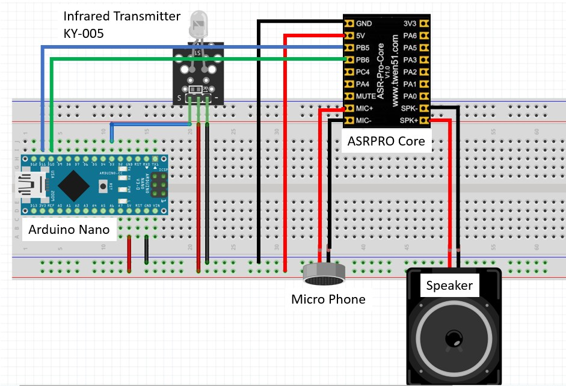

## 語音控制紅外線發射

## 電路圖



## 語音指令
<imr src="voice.jpg" />


<br><br>

展示作品
<a href="https://www.youtube.com/watch?v=Di42x7_0z_I" target="_blank">智能語音家電控制系統</a>
<br>
<a href="http://www.youtube.com/watch?feature=player_embedded&v=5OdbJlpC2AE" target="_blank"></a>
<br>影片取自 youtube

<br>

```
#include <IRremote.hpp>
#include <SoftwareSerial.h>

SoftwareSerial mySerial(11,10);//建立軟體串列埠腳位 (RX, TX)

#define IR_SEND_PIN 3

uint16_t address;
uint8_t  command;

char receivedChar; //宣告字元變數

void setup() { 
  mySerial.begin(115200);
  Serial.begin(9600);
  IrSender.begin(IR_SEND_PIN);

  //address = 0x00;   // NEC Address
  //command = 0x45;   // NEC Command

  //SendLed();
}

void loop() {
  
  if(mySerial.available()>0){
    receivedChar = mySerial.read(); //讀取字元
    Serial.println("=>");
    Serial.println(receivedChar); //打印出字元
    Serial.println("<=");

    switch (receivedChar) {
      case 'M':
        address = 0x00;   // NEC Address
        command = 0x45;   // NEC Command
        SendLed();
        break;
      case 'N':
        address = 0x00;   // NEC Address
        command = 0x45;   // NEC Command
        SendLed();  
        break;
      case 'W':  // 開啟風扇
        address = 0x00;   // NEC Address
        command = 0x45;   // NEC Command
        SendLed();  
        break;
      case 'Q':  // 關閉風扇
        address = 0x00;   // NEC Address
        command = 0x47;   // NEC Command
        SendLed();  
        break;
      case 'A':  // 打開電燈
        address = 0x80;   // NEC Address
        command = 0x02;   // NEC Command
        SendLed();  
        break;
      case 'B':  // 關閉電燈
        address = 0x80;   // NEC Address
        command = 0x02;   // NEC Command
        SendLed();  
        break;
      case 'F':  
        address = 0x00;   // NEC Address
        command = 0x45;   // NEC Command
        SendLed();  
        break;
      case 'G':
        address = 0x00;   // NEC Address
        command = 0x45;   // NEC Command
        SendLed();  
        break;
      default:
      
        break;
    }
 
    delay(100);
  }
}

void SendLed() {

    // 送完整 NEC frame（最穩）
    IrSender.sendNEC(address, command, 0);

    // NEC 標準間隔（非常重要）
    delay(120);

    // 模擬長按：改成「重送 full frame」
    for (int i = 0; i < 2; i++) {

        IrSender.sendNEC(address, command, 0);

        delay(120);
    }

    // 最後保護間隔
    delay(100);
}

```
