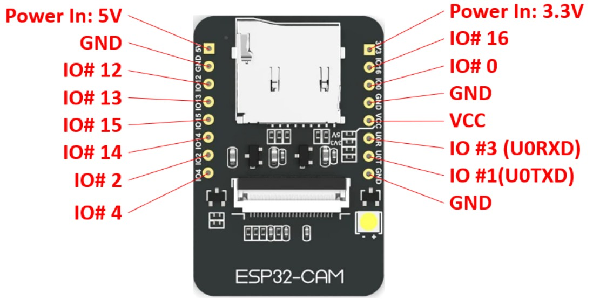
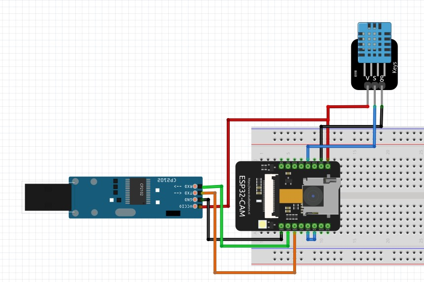

### ESP32 Cam 觀看影像，並且在網頁上看到即時的溫溼度紀錄。<br>

### ESP32 Cam 腳位

<br>

### 電路圖 <br>

<br>

### 溫溼度函式庫
請下載本頁面的 DHT.zip 才能使用

### 接腳說明 <br>
使用腳位，如果不需要監看序列埠，可以省略 TX RX 腳位。 <br>

| USB TTL | ESP32 Cam |  DHT 11  |
|---------|-----------|----------|
|  5V     |    5V     |    V     |
|  TX     |   UOR     |          |
|  RX     |   UOT     |          |
|  GND    |   GND     |    G     |
|         |   IO13    |    S     |


### Arduino 程式碼

```
#include "esp_camera.h"
#include <WiFi.h>
#include "soc/soc.h"
#include "soc/rtc_cntl_reg.h"

#include <dht.h>

#define DHTPIN 13   // DHT11 GPIO2
dht DHT;

const char* ssid = "WIFI NAME";           // 請改為 WIFI 熱點名稱
const char* password = "WIFI PASSWORD";   // 請改為 WIFI 熱點密碼

// AI Thinker ESP32-CAM
#define PWDN_GPIO_NUM     32
#define RESET_GPIO_NUM    -1
#define XCLK_GPIO_NUM      0
#define SIOD_GPIO_NUM     26
#define SIOC_GPIO_NUM     27

#define Y9_GPIO_NUM       35
#define Y8_GPIO_NUM       34
#define Y7_GPIO_NUM       39
#define Y6_GPIO_NUM       36
#define Y5_GPIO_NUM       21
#define Y4_GPIO_NUM       19
#define Y3_GPIO_NUM       18
#define Y2_GPIO_NUM        5

#define VSYNC_GPIO_NUM    25
#define HREF_GPIO_NUM     23
#define PCLK_GPIO_NUM     22

WiFiServer server(80);

// ---------------- HTML ----------------
const char index_html[] PROGMEM = R"rawliteral(
<!DOCTYPE html>
<html>
<head>
<meta charset="utf-8">
<meta name="viewport" content="width=device-width, initial-scale=1">
<title>ESP32-CAM + DHT11</title>

<style>
body {
    margin: 0;
    background: black;
    color: white;
    text-align: center;
    font-family: Arial;
}

img {
    width: 30vw;
    height: 30vh;
    object-fit: contain;
}

#info {
    margin-top: 10px;
    font-size: 18px;
}
</style>
</head>

<body>


<div id="info">Loading...</div>

<script>

let img = document.getElementById("cam");
let info = document.getElementById("info");

function refreshImage() {
    img.src = "/capture?t=" + new Date().getTime();
}

function refreshEnv() {
    fetch("/env")
    .then(res => res.text())
    .then(data => {
        info.innerHTML = data;
    });
}

img.onload = function() {
    setTimeout(refreshImage, 100);
};

function loopEnv() {
    refreshEnv();
    setTimeout(loopEnv, 2000);
}

window.onload = function() {
    refreshImage();
    loopEnv();
};

</script>

</body>
</html>
)rawliteral";

// ---------------- Camera ----------------
void startCamera()
{
    camera_config_t config;

    config.ledc_channel = LEDC_CHANNEL_0;
    config.ledc_timer = LEDC_TIMER_0;

    config.pin_d0 = Y2_GPIO_NUM;
    config.pin_d1 = Y3_GPIO_NUM;
    config.pin_d2 = Y4_GPIO_NUM;
    config.pin_d3 = Y5_GPIO_NUM;
    config.pin_d4 = Y6_GPIO_NUM;
    config.pin_d5 = Y7_GPIO_NUM;
    config.pin_d6 = Y8_GPIO_NUM;
    config.pin_d7 = Y9_GPIO_NUM;

    config.pin_xclk = XCLK_GPIO_NUM;
    config.pin_pclk = PCLK_GPIO_NUM;
    config.pin_vsync = VSYNC_GPIO_NUM;
    config.pin_href = HREF_GPIO_NUM;

    config.pin_sscb_sda = SIOD_GPIO_NUM;
    config.pin_sscb_scl = SIOC_GPIO_NUM;

    config.pin_pwdn = PWDN_GPIO_NUM;
    config.pin_reset = RESET_GPIO_NUM;

    config.xclk_freq_hz = 20000000;
    config.pixel_format = PIXFORMAT_JPEG;

    if(psramFound()) {
        config.frame_size = FRAMESIZE_VGA;
        config.jpeg_quality = 10;
        config.fb_count = 2;
    } else {
        config.frame_size = FRAMESIZE_QVGA;
        config.jpeg_quality = 12;
        config.fb_count = 1;
    }

    esp_err_t err = esp_camera_init(&config);

    if(err != ESP_OK) {
        Serial.printf("Camera init failed: 0x%x\n", err);
        ESP.restart();
    }
}

// ---------------- DHT Read ----------------
String getDHT()
{
    int chk = DHT.read11(DHTPIN);

    //if (chk != 0)
    //    return "DHT Error";

    float t = DHT.temperature;
    float h = DHT.humidity;

    return "Temp: " + String(t, 1) + " C | Hum: " + String(h, 1) + " %";
}

// ---------------- HTTP ----------------
void sendJpg(WiFiClient &client)
{
    camera_fb_t *fb = esp_camera_fb_get();

    if(!fb) {
        client.println("HTTP/1.1 500 Internal Server Error\r\n\r\n");
        return;
    }

    client.println("HTTP/1.1 200 OK");
    client.println("Content-Type: image/jpeg");
    client.println("Content-Length: " + String(fb->len));
    client.println();

    client.write(fb->buf, fb->len);
    esp_camera_fb_return(fb);
}

void sendPage(WiFiClient &client)
{
    client.println("HTTP/1.1 200 OK");
    client.println("Content-Type: text/html\r\n");
    client.print(index_html);
}

void sendEnv(WiFiClient &client)
{
    client.println("HTTP/1.1 200 OK");
    client.println("Content-Type: text/plain\r\n");
    client.println(getDHT());
}

// ---------------- Setup ----------------
void setup()
{
    WRITE_PERI_REG(RTC_CNTL_BROWN_OUT_REG, 0);

    Serial.begin(115200);

    startCamera();

    WiFi.begin(ssid, password);

    while(WiFi.status() != WL_CONNECTED) {
        delay(500);
        Serial.print(".");
    }

    Serial.println("\nWiFi Connected");
    Serial.println(WiFi.localIP());

    server.begin();
}

// ---------------- Loop ----------------
void loop()
{
    WiFiClient client = server.available();
    if(!client) return;

    String req = client.readStringUntil('\r');

    if(req.indexOf("/capture") >= 0) {
        sendJpg(client);
    }
    else if(req.indexOf("/env") >= 0) {
        sendEnv(client);
    }
    else {
        sendPage(client);
    }

    delay(1);
    client.stop();
}
```
