ESP32Cam 的應用範例

設定過程

<h2> Step1. 在 Arduino 的偏好設定， 設定開發板管理員位址 </h2>
https://dl.espressif.com/dl/package_esp32_index.json
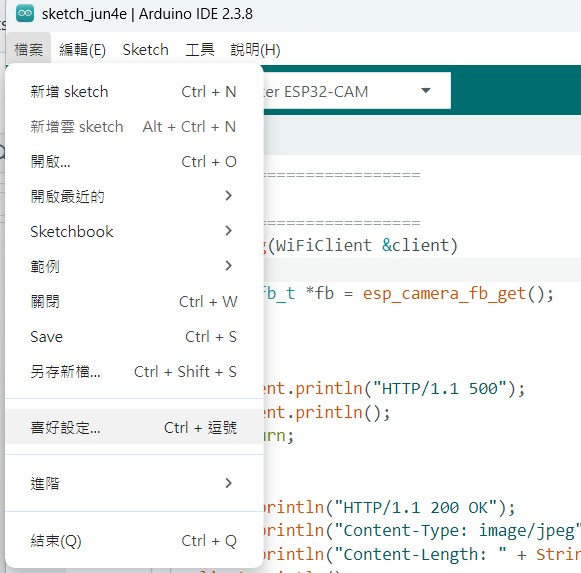
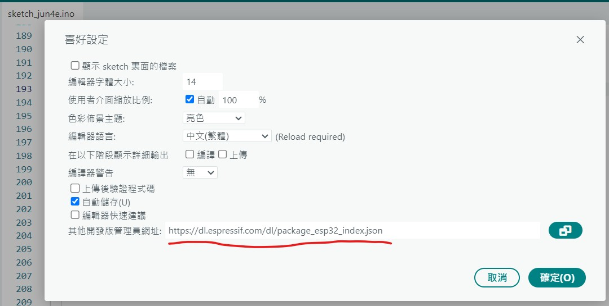

<h2>Step2.下載 ESP32 開發板</h2>
請在搜尋列輸入 ESP32，找到 esp32開發板之後，建議安裝到 2.0.17，不要安裝到 3.X 版，有相容性問題
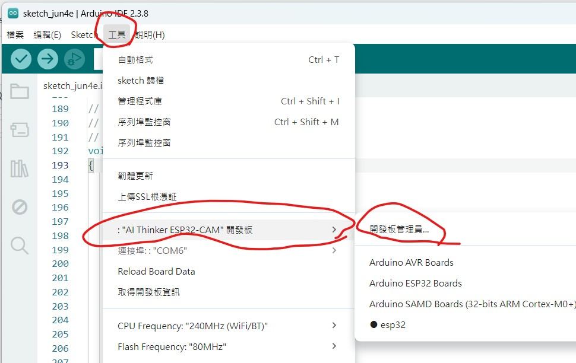
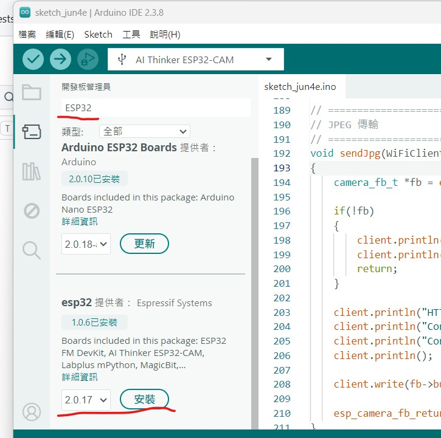

<h2>Step3.環境設定</h2>
先 選取工具 > 開發板 > esp32 > 挑選 AI Thinker ESP32-CAM 的開發板.(或 ESP32 Wrover Module 都可以)
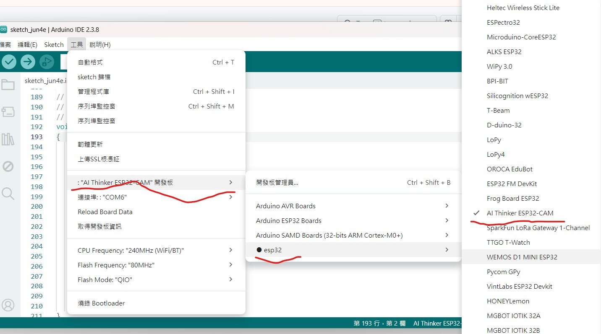 

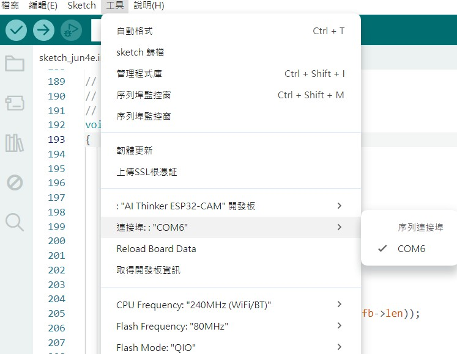 

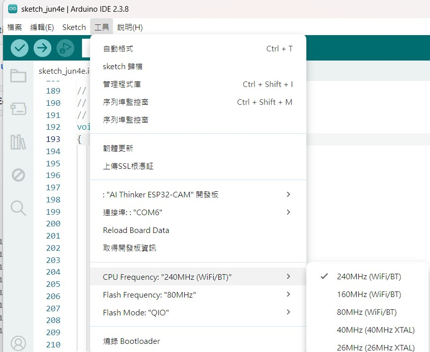 

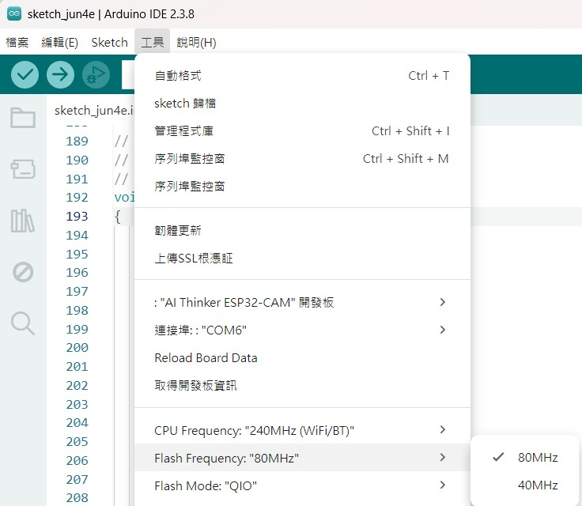 

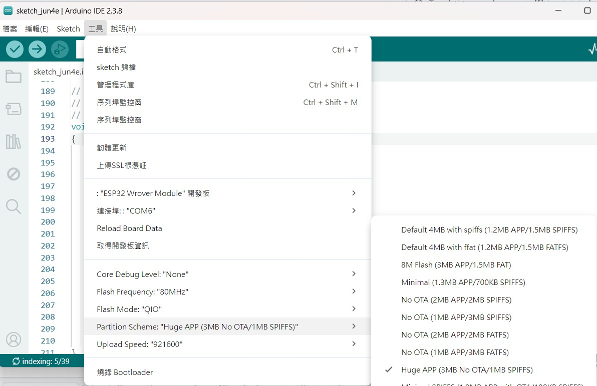 

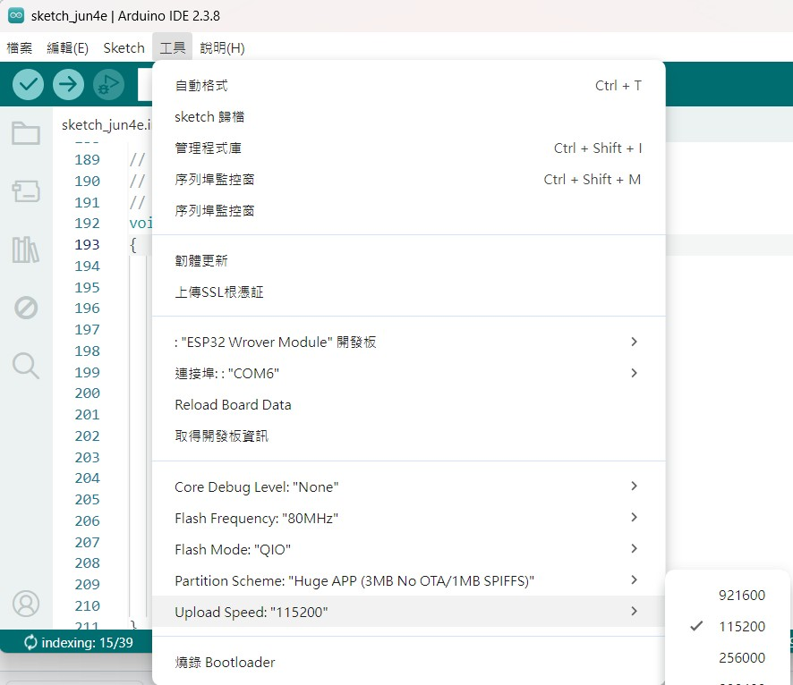 

燒錄方式 請參考下圖，使用一個 USB to TTL 的燒錄器， 

| USB TTL | ESP32 Cam |
|---------|-----------|
|  5V     |    5V     |
|  TX     |   UOR     |
|  RX     |   UOT     |
|  GND    |   GND     |

注意,燒錄時，請將ESP32 Cam 的 ID0 跟 GND 要相接，等燒錄完成再移除。 
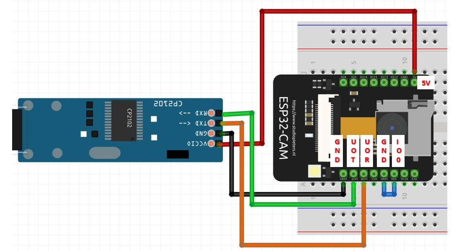

特別注意，當燒錄監控視窗出現如下圖的 Connecting....____，請記得按下 ESP32 Cam 的Reset按鈕，程式才會開始燒錄。 
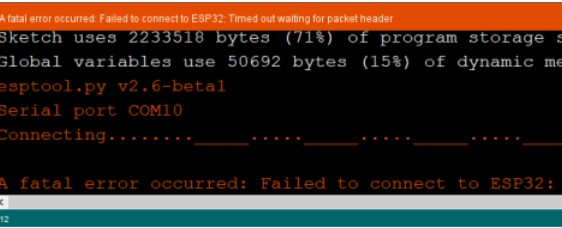

